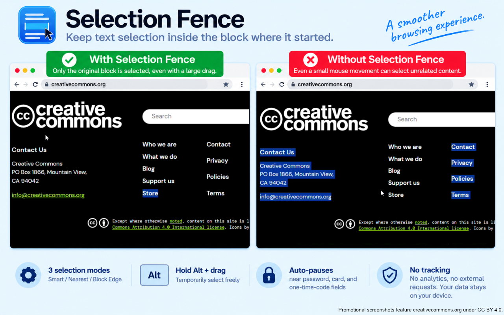

# Selection Fence

Selection Fence is a lightweight Chrome extension that prevents accidental text selections from jumping into unrelated parts of a web page.

Selection Fence は、文字をドラッグ選択したときに、選択範囲が意図せず別の段落・見出し・サイドバーなどへ広がるのを防ぐ Chrome 拡張機能です。

## Features / 主な機能

- Keeps text selection within the block where the drag started.
- Smart / Nearest / Block Edge selection modes.
- Hold **Alt** while starting a drag to temporarily bypass the restriction and select across multiple blocks.
- Automatically pauses near visible password, credit-card, and one-time-code fields.
- No analytics.
- No advertising.
- No external network requests.
- No page content, selected text, or form input values are persistently stored or transmitted.

- 選択を開始した文字ブロック内に選択範囲を留めます。
- 「自動 / 最寄り文字 / ブロック端」の3モードを選択できます。
- **Alt キーを押しながらドラッグを開始**すると、一時的に制限を解除して複数ブロックを選択できます。
- 表示中のパスワード・カード・ワンタイムコード入力欄の周辺では自動休止します。
- 解析なし。
- 広告なし。
- 外部通信なし。
- ページ本文、選択文字列、フォーム入力値を永続保存・外部送信しません。

## Selection modes / 選択モード

- **Smart / 自動（推奨）**  
  Small pointer movements use the nearest text position; larger movements stop at the block edge.  
  少しのずれはマウスに近い文字位置で止め、大きく離れた場合はブロック端で止めます。

- **Nearest / 最寄り文字**  
  Always stops at the text position closest to the pointer within the starting block.  
  常に開始ブロック内でマウスに最も近い文字位置に止めます。

- **Block Edge / ブロック端**  
  Stops at the beginning or end of the text block where the selection started.  
  選択を開始した文字ブロックの先頭または末尾で止めます。

The difference between modes is most noticeable when selecting multi-line text.

モードの違いは、複数行の文章を選択するときに分かりやすく現れます。

## Alt bypass / Alt キーによる一時解除

Hold **Alt** while starting a drag to temporarily disable Selection Fence and select across multiple blocks.

**Alt キーを押しながらドラッグを開始**すると、一時的に Selection Fence の制限を解除して、複数のブロックをまたいで選択できます。

## Sensitive input fields / 機密入力欄周辺での自動休止

For privacy and safety, Selection Fence automatically pauses its selection-limiting behavior near visible password, credit-card, and one-time-code fields.

It only checks field type, `autocomplete` attributes, visibility, and position. It does not read the values entered into those fields.

プライバシーと安全性に配慮し、表示中のパスワード・カード・ワンタイムコード入力欄の周辺では、Selection Fence の選択制限を自動的に休止します。

判定には入力欄の種類、`autocomplete` 属性、表示状態、位置のみを使用し、入力された値そのものは読み取りません。

## Privacy / プライバシー

Selection Fence processes pointer interaction and selection-related DOM information locally in the browser only as needed to provide its function.

The extension stores only the selected behavior mode (`smart`, `nearest`, or `block`) in `chrome.storage.local`.

It does not transmit page contents, selected text, browsing history, or form input values to external servers.

Selection Fence は、機能提供に必要な範囲で、マウス操作情報および文字選択に関係する DOM 情報をブラウザ内で一時的に処理します。

保存するのは、選択した動作モード（`smart` / `nearest` / `block`）のみで、`chrome.storage.local` に保存されます。

ページ本文、選択文字列、閲覧履歴、フォーム入力値を外部サーバーへ送信しません。

See [PRIVACY_POLICY.md](./PRIVACY_POLICY.md) for details.

詳細は [PRIVACY_POLICY.md](./PRIVACY_POLICY.md) をご覧ください。

## Disclaimer / 免責事項

This software is provided **"AS IS"**, without warranty of any kind, express or implied. Use of this extension is at your own risk.

To the maximum extent permitted by applicable law, the author and copyright holder shall not be liable for any claim, damages, loss of data, loss of profits, service interruption, or other liability arising from or related to the use of, inability to use, or malfunction of this software.

Selection Fence is not a security product. Its sensitive-field auto-pause feature is a convenience feature and does not guarantee protection of confidential information.

このソフトウェアは **「現状のまま（AS IS）」** 提供され、明示・黙示を問わず、いかなる保証も行いません。利用は利用者自身の責任で行ってください。

適用法令で認められる最大限の範囲において、本ソフトウェアの使用、使用不能、不具合等に関連して生じた損害、データ損失、利益損失、サービス停止、その他の請求・責任について、作者および著作権者は責任を負いません。

Selection Fence はセキュリティ製品ではありません。機密入力欄周辺での自動休止機能は補助的な利便機能であり、機密情報の保護を保証するものではありません。

## License / ライセンス

MIT License.

See [LICENSE](./LICENSE).

MIT ライセンスで公開しています。詳細は [LICENSE](./LICENSE) をご覧ください。
